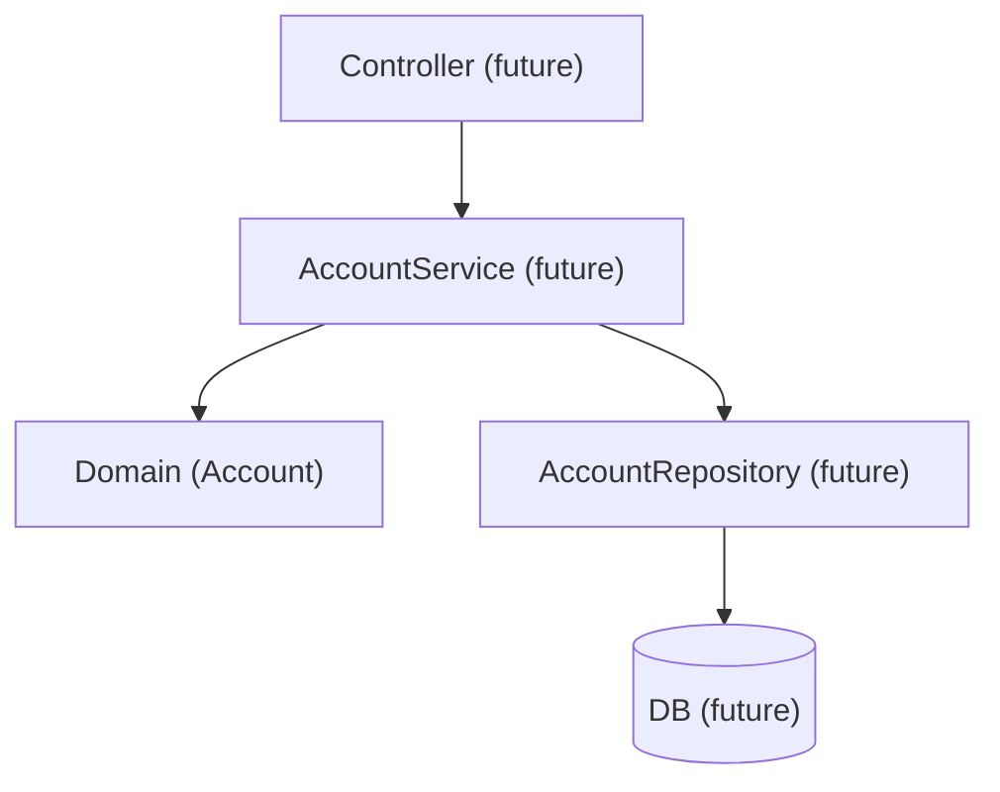

# Containers / Layers (today)

- Related: [ADR-0001 — Domain-first](./decisions/ADR-0001-domain-first.md)

- **bank (single module Maven project)**  
  - `domain` package — entities and value objects (e.g., Account).  
  - `app` package — use cases/services (later).  
  - `adapters` package — IO / REST / DB (later).

For now, all code is in one module; we keep package boundaries clean so we can split later if needed.

**Data flow example (planned):**
Client → Controller → Service (use-case) → Domain (Account) → Repository → DB

## Planned component interactions

