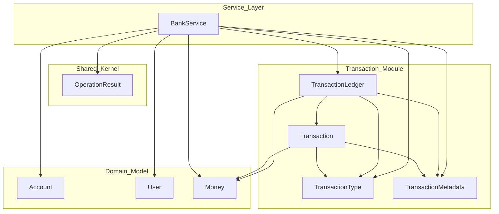

# Domain Model (current)

- Related: [ADR-0001 — Domain-first](./decisions/ADR-0001-domain-first.md)

## Glossary
- **Account** — holds a balance for a customer; supports deposit/withdraw.  
- **Money** — value object with `amount` and (later) `currency`.  
- **Transaction** — append-only record of money movement stored in the ledger.  
- **TransactionLedger** — in-memory append-only store that groups transactions by account and enforces immutability.

## Dependency Map
The Mermaid graph is sourced from `docs/architecture/dependency-map.mmd` and highlights which classes collaborate today. Service-layer nodes at the top depend on the domain, shared kernel, and transaction module below, making it easy to see where future Spring beans or adapters will plug in.

## Account (exists)
**State (today):**
- id: `AccountId`
- balance: number (later `Money`)

**Operations (tests drive behavior):**
- `deposit(amount > 0)` → increases balance
- `withdraw(amount > 0, balance >= amount)` → decreases balance

**Invariants:**
- Amounts must be positive
- (Planned) No overdraft unless explicitly allowed

## BankService (exists)
- Holds user -> account relationships in-memory.
- Provides `depositFunds`, `withdrawFunds`, and `transferMoney` orchestration methods.
- Each operation returns an `OperationResult` that carries a success flag, the user-facing message defined in the business doc, and (when successful) the resulting balance.
- Validation order: locate account(s) → assert positive amount → assert sufficient funds (withdraw/transfer) → mutate state.
- After a successful mutation, `BankService` records an immutable `Transaction` via the injected `TransactionLedger`. Transfers create two entries (debit/credit) that share a correlation id stored in `TransactionMetadata`.

## TransactionLedger (exists)
**State:**
- `Map<AccountId, List<Transaction>>` — append-only history per account.

**Operations:**
- `record(accountId, type, money, metadata)` → validates inputs, generates a transaction id/timestamp, appends to the per-account list.
- `getTransactions(accountId)` → returns an immutable snapshot of recorded entries, preserving chronological order.

**Invariants:**
- Account ids must be non-null/non-blank.
- Recorded transactions are never mutated or removed; replay order reflects insertion order.
- Metadata defaults to `TransactionMetadata.empty()` but typically carries a UUID and description for traceability (see BANK-7 “Track Append-Only Transactions”).

## WorkflowPort (new seam)
- Interface for triggering workflow automation (e.g., Camunda) when domain events occur such as onboarding a user.
- Current implementation `NoopWorkflowAdapter` is a Spring bean that does nothing, acting as a placeholder so a real engine adapter can be dropped in later without touching `BankService`.
