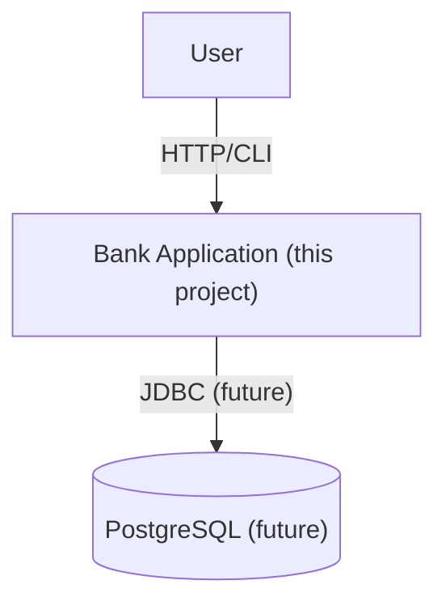

# Bank — Architecture Overview

**Purpose:** side project to learn banking business logic, Java patterns, and later DevOps/tooling.

**Scope (now):** single Java app with simple domain (Account, Transaction*), CLI or minimal REST later.

**Principles:**
- Domain-first: business logic in plain Java (no framework in core).
- Tests first for domain operations (deposit/withdraw).
- Append-only transactions for auditability.

## System context

**Next milestones:**
1) Deposit + Balance (domain + unit tests)
2) Withdraw (domain + tests)
3) Transfer (domain + tests; idempotency note)

See:
- [Containers / layers](./container.md)
- [Domain model](./domain.md)
- [ADR-0001: Domain-first](./decisions/ADR-0001-domain-first.md)
