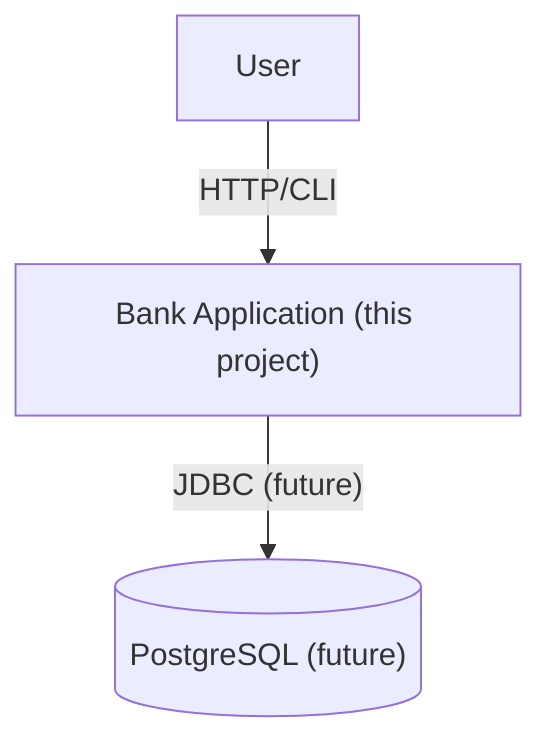

# Bank — Architecture Overview

**Purpose:** side project to learn banking business logic, Java patterns, and later DevOps/tooling.

**Scope (now):** single Java app with simple domain (Account, Transaction*), CLI or minimal REST later.

**Principles:**
- Domain-first: business logic in plain Java (no framework in core).
- Tests first for domain operations (deposit/withdraw).
- Append-only transactions for auditability.

**Current iteration highlights:**
- BankService exposes deposit/withdraw/transfer use cases that return a shared `OperationResult`, ensuring callers surface consistent validation messaging.
- Validation order follows the business overview: reject missing accounts, block zero/negative amounts, then enforce the no-overdraft rule.

## System context

**Next milestones:**
1) Add CLI adapter that consumes `OperationResult` messaging.
2) Persist immutable transaction log alongside balances.
3) Introduce database-backed repositories with optimistic locking.

See:
- [Containers / layers](./container.md)
- [Domain model](./domain.md)
- [ADR-0001: Domain-first](./decisions/ADR-0001-domain-first.md)
